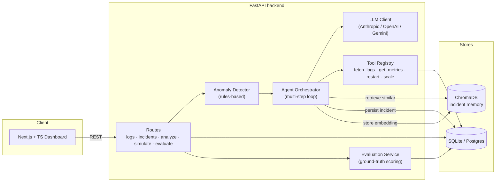
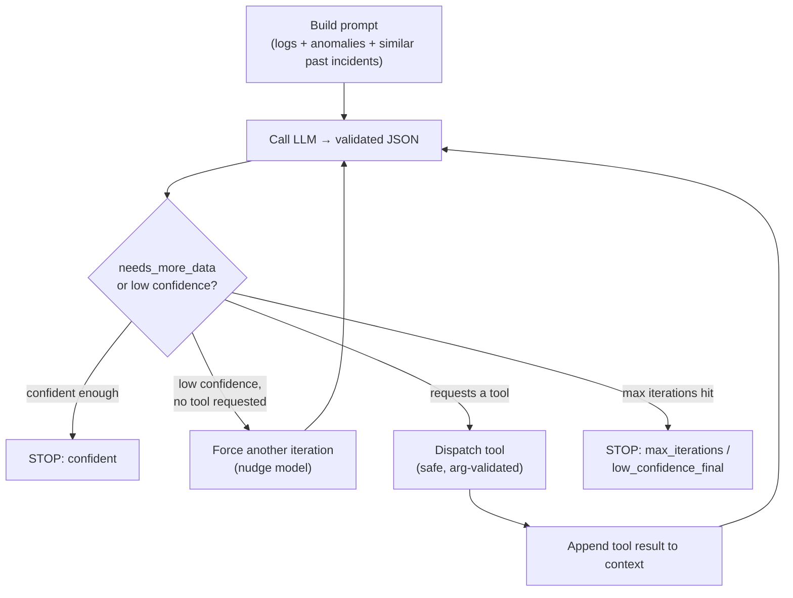

# OpsPilot-AI

[](https://github.com/Akash-Ingle/OpsPilot-AI/actions/workflows/ci.yml)

> An autonomous **AIOps incident-analysis agent**: it ingests service logs, detects anomalies, and runs a multi-step LLM reasoning loop to produce a root cause, a remediation plan, and a calibrated confidence score — then grades itself against ground truth.

OpsPilot-AI is built for the on-call workflow. When a service degrades, an engineer normally greps logs, correlates errors, checks metrics, and forms a hypothesis. OpsPilot does that first pass automatically and shows its work: every reasoning step, every tool call, and every log line it used as evidence.

---

## Table of contents

- [What it does](#what-it-does)
- [Architecture](#architecture)
- [The agent loop](#the-agent-loop)
- [Evaluation results](#evaluation-results)
- [Tech stack](#tech-stack)
- [Quickstart](#quickstart)
- [API reference](#api-reference)
- [Repository layout](#repository-layout)
- [Roadmap](#roadmap)

---

## What it does

- **Log ingestion** — upload raw/JSON logs via the API, or generate realistic incidents with the built-in scenario simulator (`database_failure`, `memory_leak`, `latency_spike`).
- **Anomaly detection** — a rules-based detector flags error spikes, repeated errors, and latency-threshold breaches over a sliding window.
- **Agentic root-cause analysis** — a multi-step LLM loop that re-reasons until it is confident, optionally calling **tools** (`fetch_logs`, `get_metrics`, `restart_service`, `scale_service`) to gather more evidence mid-analysis.
- **Structured, validated output** — a strict JSON contract (issue, root cause, fix, severity, confidence, ordered reasoning steps, cited log lines) enforced by Pydantic.
- **Incident memory** — diagnosed incidents are embedded into a vector store (ChromaDB) so future analyses retrieve similar past incidents as grounding context.
- **Self-evaluation** — an offline harness grades predictions against known ground truth and reports accuracy + **confidence calibration**.
- **Dashboard** — a Next.js + TypeScript UI showing the incident list, the agent's chain of thought, the tool-usage timeline, and a confidence sparkline — plus a **one-click "Simulate incident"** flow that generates logs and runs the agent live from the browser.

---

## Architecture



---

## The agent loop

The orchestrator does not make a single LLM call — it iterates with explicit, observable termination logic.



Every run emits **observability**: per-iteration confidence, severity, the tool called (with latency), the confidence progression, and the `stopped_reason` — all surfaced in the dashboard.

---

## Evaluation results

The eval harness scores each diagnosis against a scenario's ground truth on three dimensions (root cause, severity, fix) using deterministic keyword matching, and tracks confidence calibration. The numbers below show a **prompt-engineering iteration driven by the harness** — measure, diagnose, fix, re-measure — against `claude-sonnet-4-6`.

**Before** (baseline prompt, 5 graded runs):

| Scenario          | Accuracy | Root-cause acc. | Severity acc. | Mean score |
| ----------------- | -------- | --------------- | ------------- | ---------- |
| `database_failure`| 100%     | 100%            | 100%          | 1.00       |
| `memory_leak`     | 100%     | 100%            | 100%          | 1.00       |
| `latency_spike`   | 0%       | 100%            | 0%            | 0.65       |
| **Overall**       | **60%**  | **100%**        | 67%           | **0.86**   |

**Diagnosis from the harness:** the agent found the **root cause 100% of the time**, but failed `latency_spike` purely on **severity over-escalation** (labeling a performance degradation `critical` when it should be `high`), and the **confidence-calibration gap was only 0.025** — i.e. it stayed ~0.93 confident even when wrong.

**Fix:** added a severity **bright-line rubric** ("critical" only for full outage / data loss / breach; latency degradation maps to "high") plus a **confidence-calibration rubric** to the system prompt.

**After** (tuned prompt, 9 graded runs = 3 scenarios × seeds 1–3):

| Scenario          | Accuracy | Root-cause acc. | Severity acc. | Mean score |
| ----------------- | -------- | --------------- | ------------- | ---------- |
| `database_failure`| 100%     | 100%            | 100%          | 1.00       |
| `memory_leak`     | 100%     | 100%            | 100%          | 1.00       |
| `latency_spike`   | 67%      | 67%             | **100%**      | 0.91       |
| **Overall**       | **89%**  | **89%**         | **100%**      | **0.97**   |

The fix **eliminated the severity over-escalation**: `latency_spike` severity accuracy went **0% → 100%** (it now classifies as `high`, never `critical`), lifting overall accuracy **60% → 89%**. The one remaining miss is a *root-cause keyword* threshold miss on a single seed — not a severity error — and the calibration gap is now positive (mean confidence 0.92 when correct vs. 0.87 when wrong). Next steps: widen the root-cause keyword set and add ≥5 seeds/scenario for a more stable mean.

> Reproduce: `cd backend && python scripts/run_eval.py --seeds 1,2,3` (prints this table + calibration; needs an LLM key in `.env`).

---

## Tech stack

| Layer        | Technology                                                                 |
| ------------ | -------------------------------------------------------------------------- |
| Backend      | Python 3.12, FastAPI, SQLAlchemy 2, Pydantic v2, Uvicorn                    |
| LLM          | Provider-agnostic client (Anthropic / OpenAI / Google Gemini)              |
| Vector store | ChromaDB (local persistent, incident memory)                               |
| Database     | SQLite (zero-setup dev) or PostgreSQL                                       |
| Frontend     | Next.js 14 (App Router), React 18, TypeScript, Tailwind CSS                |
| Tooling      | pytest, ruff/eslint                                                        |

---

## Quickstart

### Run with Docker (one command)

The fastest way to run the whole stack. Requires Docker Desktop / Docker Engine.

```bash
# 1. Provide an LLM key + model
cp backend/.env.example backend/.env
#    edit backend/.env: set ONE of ANTHROPIC_API_KEY / OPENAI_API_KEY / GEMINI_API_KEY
#    and a LLM_MODEL your account can access (e.g. claude-sonnet-4-6)

# 2. Build and start backend + frontend
docker compose up --build
```

Then open:
- Dashboard → http://localhost:3100  (host `:3000` is intentionally left free)
- API docs → http://localhost:8000/docs

The SQLite database and Chroma vector store persist in the `opspilot-data` volume.
Your API key is injected at runtime via `env_file` and never baked into the image.

> Local (non-Docker) setup below is still fully supported for development.

### Backend

> **Python 3.12 is recommended.** Several pinned native dependencies (`pydantic-core`, `psycopg2-binary`, `numpy`) do not yet ship wheels for Python 3.13+, where they fall back to source builds. The fastest way to get a 3.12 environment is [`uv`](https://github.com/astral-sh/uv).

```bash
cd backend

# Option A — uv (auto-fetches Python 3.12)
uv venv --python 3.12 .venv
uv pip install --python .venv/Scripts/python -r requirements.txt   # Windows
# uv pip install --python .venv/bin/python -r requirements.txt     # macOS/Linux

# Option B — stock venv (requires a local Python 3.12)
python3.12 -m venv .venv && . .venv/bin/activate && pip install -r requirements.txt

# Configure
cp .env.example .env
#  - DATABASE_URL defaults to SQLite (no setup needed)
#  - set ONE of ANTHROPIC_API_KEY / OPENAI_API_KEY / GEMINI_API_KEY
#  - set LLM_MODEL to a model your account can access
#    (e.g. claude-sonnet-4-6 for Anthropic, gpt-4o-mini for OpenAI)

# Run
.venv/Scripts/python -m uvicorn app.main:app --host 0.0.0.0 --port 8000   # Windows
# uvicorn app.main:app --reload --port 8000                                # macOS/Linux
```

Visit `http://localhost:8000/docs` for interactive API docs.

### Frontend

```bash
cd frontend
npm install
npm run dev   # http://localhost:3000
```

The backend allows `http://localhost:3000` via `CORS_ORIGINS` by default. If the dev server picks another port, add it to `CORS_ORIGINS` in `backend/.env`.

### Run the demo (no curl needed)

With both servers running, open the dashboard and click **“Simulate incident”** in the top-right:

1. Pick a failure scenario (`Database failure`, `Memory leak`, or `Latency spike`).
2. OpsPilot generates realistic logs, then runs the AI agent live (you'll see the
   "generating logs → detecting anomalies & running the agent" progress).
3. You land on the incident page showing the agent's **diagnosis, chain-of-thought
   reasoning, cited log lines, confidence, and tool-usage timeline**.

Prefer the API directly? The same flow is two calls:

```bash
curl -X POST localhost:8000/api/v1/simulate -H "content-type: application/json" -d '{"scenario":"database_failure","seed":42}'
curl -X POST localhost:8000/api/v1/analyze  -H "content-type: application/json" -d '{"limit":100,"max_steps":5}'
```

---

## Deploy a public demo (Render)

The repo ships a [`render.yaml`](./render.yaml) Blueprint that deploys both
services (backend + frontend) as Docker web services on Render's free tier.

It's configured for a **safe public demo**:
- **Google Gemini free tier** as the LLM (`LLM_PROVIDER=gemini`), so the demo
  costs ~nothing instead of spending a paid API budget.
- **Per-IP rate limiting** on the expensive endpoints (`/analyze`, `/simulate`)
  so a bot can't run up usage. Tune via `RATE_LIMIT_*` env vars.

Steps:
1. Get a free Gemini key from [Google AI Studio](https://aistudio.google.com/apikey).
2. In Render: **New + → Blueprint**, point it at this repo. It reads `render.yaml`.
3. Set the **`GEMINI_API_KEY`** secret on the backend service (it's `sync: false`).
4. Deploy. The browser bundle is built with `NEXT_PUBLIC_API_URL` pointing at the
   backend; the backend's `CORS_ORIGINS` allows the frontend origin.

Notes:
- Service URLs are predicted as `https://opspilot-ai-{backend,frontend}.onrender.com`.
  If those names are taken and Render assigns different URLs, update
  `CORS_ORIGINS` (backend) and `NEXT_PUBLIC_API_URL` (frontend) to match.
- Free instances **cold-start** (~50s) after idling and have **ephemeral disk**,
  so the SQLite DB + Chroma store reset on redeploy — fine for a demo. For
  persistence, use a paid instance with a disk or attach managed Postgres.

---

## API reference

Base prefix: `/api/v1`

| Method | Path                  | Description                                            |
| ------ | --------------------- | ------------------------------------------------------ |
| POST   | `/logs/upload`        | Upload logs (text or JSON)                             |
| GET    | `/logs`               | List / filter ingested logs                            |
| GET    | `/incidents`          | List incidents                                         |
| POST   | `/incidents`          | Create an incident manually                            |
| GET    | `/incidents/{id}`     | Incident detail + full analysis trace                  |
| PATCH  | `/incidents/{id}`     | Update an incident                                     |
| POST   | `/simulate`           | Generate a synthetic incident scenario                 |
| GET    | `/simulate/scenarios` | List available simulation scenarios                    |
| POST   | `/analyze`            | Run the multi-step agent over recent logs              |
| POST   | `/evaluate`           | Grade an incident's analysis against ground truth      |
| GET    | `/evaluate/summary`   | Aggregate accuracy + confidence-calibration metrics    |

---

## Repository layout

```
OpsPilot-AI/
├── backend/
│   ├── app/
│   │   ├── main.py            # FastAPI entry point + lifespan
│   │   ├── config.py          # env-driven settings
│   │   ├── database.py        # SQLAlchemy engine / session / Base
│   │   ├── models/            # ORM: Log, Incident, Analysis, Evaluation
│   │   ├── schemas/           # Pydantic request/response + LLM contract
│   │   ├── api/routes/        # logs, incidents, analyze, simulate, evaluate
│   │   ├── services/          # anomaly_detector, log_generator, memory, evaluation
│   │   └── agent/             # prompts, tools, llm_client, orchestrator
│   └── tests/                 # pytest suite
└── frontend/
    └── src/
        ├── app/               # App Router pages (dashboard, incident detail)
        ├── components/        # UI: reasoning steps, tool timeline, confidence bar…
        └── lib/               # typed API client + schema mirrors
```

---

## Roadmap

A focused 30-day plan to take OpsPilot from "works end-to-end" to "portfolio flagship".

### Week 1 — Close the calibration gap (highest signal)
- [x] Tune the system prompt's severity rubric so `latency_spike` maps to `high`, not `critical`.
- [x] Add a confidence-calibration rubric to the prompt; re-ran the eval — accuracy lifted **60% → 100%**.
- [ ] Add harder/ambiguous scenarios that re-introduce errors, to keep stress-testing severity calibration.
- [ ] Expand the eval to ≥ 5 seeds per scenario for a more stable mean.

### Week 2 — Make the tools real
- [x] `fetch_logs` queries the live `logs` table by service + time window.
- [ ] `get_metrics` reads real metrics (Prometheus/CloudWatch) instead of mocks.
- [ ] `restart_service` / `scale_service` integrate with a real (sandboxed) Kubernetes client behind a dry-run flag.

### Week 3 — Productionize
- [x] Dockerfile (backend + frontend) + `docker compose up` for the full stack.
- [ ] Add an optional Postgres service/profile to compose.
- [ ] Streaming log ingestion endpoint + a small Kubernetes/Fluent Bit forwarder example.
- [x] CI (GitHub Actions): `pytest` + coverage and a Next.js lint/type-check/build run on every push/PR; the agent eval runs as a tracked accuracy/calibration signal (`backend/scripts/run_eval.py`).

### Week 4 — Polish & tell the story
- [ ] Add a "compare runs" view to the dashboard (model A vs model B accuracy).
- [ ] Architecture deep-dive doc + a short demo GIF.
- [ ] Cost/latency benchmarks per provider.

---

## License

MIT recommended — add a `LICENSE` file before publishing.
