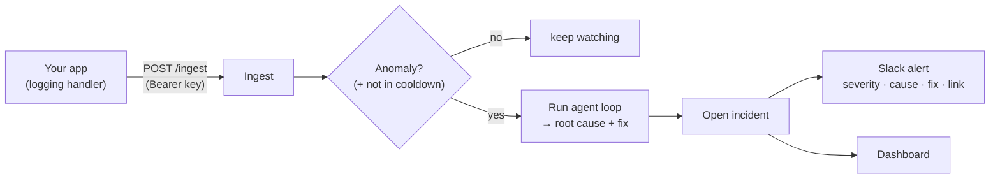
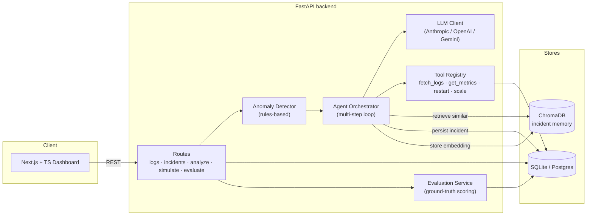
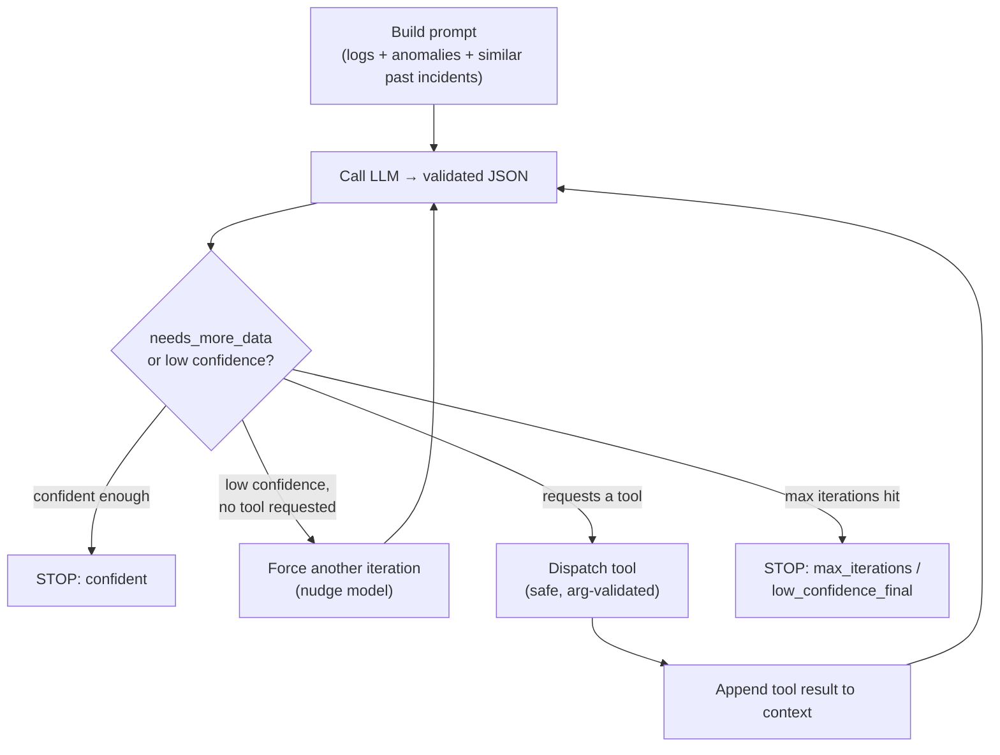

# OpsPilot-AI

[](https://github.com/Akash-Ingle/OpsPilot-AI/actions/workflows/ci.yml)

**[Live demo →](https://opspilot-ai-frontend.onrender.com)** · try the public sandbox instantly (free-tier host — the first request may take ~30s to wake).

> An autonomous **AIOps incident-analysis agent**: point your app's logs at it, and it watches the stream, detects anomalies, runs a multi-step LLM reasoning loop to produce a root cause + remediation + calibrated confidence, opens an incident, and alerts you in Slack — then grades itself against ground truth.

OpsPilot-AI is built for the on-call workflow. When a service degrades, an engineer normally greps logs, correlates errors, checks metrics, and forms a hypothesis. OpsPilot does that first pass automatically and shows its work: every reasoning step, every tool call, and every log line it used as evidence.

**Why not just paste logs into ChatGPT?** Because a chat box is *pull* — you have to already know something broke, then copy the relevant lines out of thousands. OpsPilot is *push*: it ingests your live log stream, surfaces the anomaly, pulls the relevant lines automatically, remembers similar past incidents, and pings you with the diagnosis before you open a dashboard.

---

## Table of contents

- [What it does](#what-it-does)
- [Connect your app (the product loop)](#connect-your-app-the-product-loop)
- [Architecture](#architecture)
- [The agent loop](#the-agent-loop)
- [Evaluation results](#evaluation-results)
- [Design decisions & trade-offs](#design-decisions--trade-offs)
- [Metrics & observability](#metrics--observability)
- [Tech stack](#tech-stack)
- [Quickstart](#quickstart)
- [Deploy a public demo](#deploy-a-public-demo-render)
- [API reference](#api-reference)
- [Repository layout](#repository-layout)

---

## What it does

- **Live log ingestion + always-on watching** — apps ship logs to a keyed `/ingest` endpoint (a 2-line snippet). OpsPilot watches each project's stream and, when anomalies trip, **auto-opens an incident and alerts Slack** — no human has to ask. (Or generate realistic incidents with the built-in simulator: `database_failure`, `memory_leak`, `latency_spike`.)
- **Anomaly detection** — a rules-based detector flags error spikes, repeated errors, and latency-threshold breaches over a sliding window.
- **Agentic root-cause analysis** — a multi-step LLM loop that re-reasons until it is confident, optionally calling **tools** (`fetch_logs`, `get_metrics`, `restart_service`, `scale_service`) to gather more evidence mid-analysis.
- **Structured, validated output** — a strict JSON contract (issue, root cause, fix, severity, confidence, ordered reasoning steps, cited log lines) enforced by Pydantic.
- **Incident memory** — diagnosed incidents are embedded into a vector store (ChromaDB) so future analyses retrieve similar past incidents as grounding context.
- **Self-evaluation** — an offline harness grades predictions against known ground truth and reports accuracy + **confidence calibration**.
- **Dashboard** — a Next.js + TypeScript UI showing the incident list, the agent's chain of thought, the tool-usage timeline, and a confidence sparkline — plus a **one-click "Simulate incident"** flow that generates logs and runs the agent live from the browser. Anyone can try the **public sandbox**; signing in gives a **private space** for your own apps.

---

## Connect your app (the product loop)

This is what makes OpsPilot a tool rather than a prompt. The **Connect your app** page issues a project API key and a copy-paste snippet; from then on the loop is automatic:



**Design notes that make it production-shaped:**

- **Public sandbox + private accounts.** Anonymous visitors share a public sandbox (so they can try the agent with zero friction). Signing up (email/password, hashed with **bcrypt**) gives a private space: the dashboard authenticates via a server-side session in an **httpOnly, Secure cookie** kept first-party through a same-origin Next.js proxy — so the token is never readable by page JavaScript (XSS-resistant). Reads are scoped to the signed-in user's projects.
- **API keys for machines.** Each project also gets an `opsp_…` ingestion key; only its **SHA-256 hash** is stored (raw key shown once). Logs and incidents are scoped to the project, and cross-tenant access returns 404 (never leaks existence).
- **Event-driven, not a cron.** The watcher runs as a background task triggered by ingestion, so it works even on a free-tier host that sleeps between requests.
- **Cost guardrail.** A per-project **cooldown** caps auto-analysis to once per window, so a log flood can't spam the LLM or burn a free-tier quota. The cached-analysis fallback covers exhausted quota.
- **Alerting that never breaks the path.** Slack delivery is best-effort and isolated — a webhook failure is logged, never propagated to ingestion.

```python
# The whole integration: a logging handler that ships logs to OpsPilot.
import logging, requests

class OpsPilotHandler(logging.Handler):
    def emit(self, record):
        try:
            requests.post(
                "https://<your-backend>/api/v1/ingest",
                headers={"Authorization": "Bearer opsp_your_key"},
                json={"logs": [{
                    "service_name": record.name,
                    "severity": record.levelname.lower(),
                    "message": self.format(record),
                }]},
                timeout=5,
            )
        except Exception:
            pass  # logging must never break the app

logging.getLogger().addHandler(OpsPilotHandler())
```

**Try it without writing any code.** [`examples/sample_app.py`](./examples/sample_app.py) is a dependency-free log shipper that simulates an app. Create a project on the **Connect your app** page, grab the key, then:

```bash
# Fire one incident burst and watch an incident open automatically:
python examples/sample_app.py --api-key opsp_... --scenario database_failure

# Or stream healthy traffic with a periodic incident burst (good for a live demo):
python examples/sample_app.py --api-key opsp_... --loop
```

---

## Architecture



---

## The agent loop

The orchestrator does not make a single LLM call — it iterates with explicit, observable termination logic.



Every run emits **observability**: per-iteration confidence, severity, the tool called (with latency), the confidence progression, and the `stopped_reason` — all surfaced in the dashboard.

---

## Evaluation results

The eval harness scores each diagnosis against a scenario's ground truth on three dimensions (root cause, severity, fix) using deterministic keyword matching, and tracks confidence calibration. The numbers below show a **prompt-engineering iteration driven by the harness** — measure, diagnose, fix, re-measure — against `claude-sonnet-4-6`.

**Before** (baseline prompt, 5 graded runs):

| Scenario          | Accuracy | Root-cause acc. | Severity acc. | Mean score |
| ----------------- | -------- | --------------- | ------------- | ---------- |
| `database_failure`| 100%     | 100%            | 100%          | 1.00       |
| `memory_leak`     | 100%     | 100%            | 100%          | 1.00       |
| `latency_spike`   | 0%       | 100%            | 0%            | 0.65       |
| **Overall**       | **60%**  | **100%**        | 67%           | **0.86**   |

**Diagnosis from the harness:** the agent found the **root cause 100% of the time**, but failed `latency_spike` purely on **severity over-escalation** (labeling a performance degradation `critical` when it should be `high`), and the **confidence-calibration gap was only 0.025** — i.e. it stayed ~0.93 confident even when wrong.

**Fix:** added a severity **bright-line rubric** ("critical" only for full outage / data loss / breach; latency degradation maps to "high") plus a **confidence-calibration rubric** to the system prompt.

**After** (tuned prompt, 9 graded runs = 3 scenarios × seeds 1–3):

| Scenario          | Accuracy | Root-cause acc. | Severity acc. | Mean score |
| ----------------- | -------- | --------------- | ------------- | ---------- |
| `database_failure`| 100%     | 100%            | 100%          | 1.00       |
| `memory_leak`     | 100%     | 100%            | 100%          | 1.00       |
| `latency_spike`   | 67%      | 67%             | **100%**      | 0.91       |
| **Overall**       | **89%**  | **89%**         | **100%**      | **0.97**   |

The fix **eliminated the severity over-escalation**: `latency_spike` severity accuracy went **0% → 100%** (it now classifies as `high`, never `critical`), lifting overall accuracy **60% → 89%**. The calibration gap is now positive (mean confidence 0.92 when correct vs. 0.87 when wrong), so the agent's confidence is a meaningful signal.

**On the public demo's model (`gemini-2.5-flash-lite`, 9 graded runs):**

| Scenario          | Accuracy | Severity acc. | Mean score |
| ----------------- | -------- | ------------- | ---------- |
| `database_failure`| 100%     | 100%          | 1.00       |
| `memory_leak`     | 100%     | 100%          | 1.00       |
| `latency_spike`   | 33%      | **100%**      | 0.68       |
| **Overall**       | **78%**  | **100%**      | **0.89**   |

The severity bright-line rubric **generalizes across models**: on Gemini, `latency_spike` is classified `high` on every run (zero over-escalation), same as Claude. The lower overall number is the same *root-cause keyword* sensitivity (Gemini phrases the latency diagnosis differently), not a severity regression. The CI gate runs this exact eval against Gemini on every push.

> Reproduce: `cd backend && python scripts/run_eval.py --seeds 1,2,3` (prints this table + calibration; needs an LLM key in `.env`).

---

## Design decisions & trade-offs

The interesting engineering here is in the *choices*, not the line count. A few:

- **Event-driven watcher, not a cron.** Auto-analysis is a background task kicked by ingestion, so it works on a free-tier host that sleeps between requests — and a per-project cooldown keeps a log flood from spamming the LLM.
- **Tenant isolation returns 404, never 403.** Cross-tenant access doesn't leak that a resource exists. API keys are stored only as SHA-256 hashes; sessions live in httpOnly, Secure cookies kept first-party via a same-origin Next.js proxy (XSS-resistant).
- **Degrade, don't fail.** When the LLM quota is exhausted the agent serves a cached analysis (flagged `served_from_cache`) instead of erroring; Slack delivery and vector-memory writes are best-effort and never block the ingestion/analysis path.

See **[DESIGN.md](./DESIGN.md)** for the full write-up (architecture rationale, the agent's termination logic, and what I'd do next at scale).

---

## Metrics & observability

Beyond per-incident reasoning traces in the dashboard, the backend exposes a
Prometheus-format endpoint at **`GET /metrics`** (app root, unauthenticated —
scrape it from Prometheus/Grafana):

```bash
curl localhost:8000/metrics
```

It publishes default process metrics plus app counters:
`opspilot_logs_ingested_total`, `opspilot_incidents_opened_total`, and
`opspilot_analyses_total{served_from_cache="true|false"}`.

---

## Tech stack

| Layer        | Technology                                                                 |
| ------------ | -------------------------------------------------------------------------- |
| Backend      | Python 3.12, FastAPI, SQLAlchemy 2, Pydantic v2, Uvicorn                    |
| LLM          | Provider-agnostic client (Anthropic / OpenAI / Google Gemini)              |
| Vector store | ChromaDB (local persistent, incident memory)                               |
| Database     | SQLite (zero-setup dev) or PostgreSQL                                       |
| Frontend     | Next.js 14 (App Router), React 18, TypeScript, Tailwind CSS                |
| Observability| Prometheus metrics endpoint (`/metrics`)                                   |
| Tooling      | pytest, vitest, ruff/eslint                                                |

---

## Quickstart

### Run with Docker (one command)

The fastest way to run the whole stack. Requires Docker Desktop / Docker Engine.

```bash
# 1. Provide an LLM key + model
cp backend/.env.example backend/.env
#    edit backend/.env: set ONE of ANTHROPIC_API_KEY / OPENAI_API_KEY / GEMINI_API_KEY
#    and a LLM_MODEL your account can access (e.g. claude-sonnet-4-6)

# 2. Build and start backend + frontend
docker compose up --build
```

Then open:
- Dashboard → http://localhost:3100  (host `:3000` is intentionally left free)
- API docs → http://localhost:8000/docs

The SQLite database and Chroma vector store persist in the `opspilot-data` volume.
Your API key is injected at runtime via `env_file` and never baked into the image.

> Local (non-Docker) setup below is still fully supported for development.

### Backend

> **Python 3.12 is recommended.** Several pinned native dependencies (`pydantic-core`, `psycopg2-binary`, `numpy`) do not yet ship wheels for Python 3.13+, where they fall back to source builds. The fastest way to get a 3.12 environment is [`uv`](https://github.com/astral-sh/uv).

```bash
cd backend

# Option A — uv (auto-fetches Python 3.12)
uv venv --python 3.12 .venv
uv pip install --python .venv/Scripts/python -r requirements.txt   # Windows
# uv pip install --python .venv/bin/python -r requirements.txt     # macOS/Linux

# Option B — stock venv (requires a local Python 3.12)
python3.12 -m venv .venv && . .venv/bin/activate && pip install -r requirements.txt

# Configure
cp .env.example .env
#  - DATABASE_URL defaults to SQLite (no setup needed)
#  - set ONE of ANTHROPIC_API_KEY / OPENAI_API_KEY / GEMINI_API_KEY
#  - set LLM_MODEL to a model your account can access
#    (e.g. claude-sonnet-4-6 for Anthropic, gpt-4o-mini for OpenAI)

# Run
.venv/Scripts/python -m uvicorn app.main:app --host 0.0.0.0 --port 8000   # Windows
# uvicorn app.main:app --reload --port 8000                                # macOS/Linux
```

Visit `http://localhost:8000/docs` for interactive API docs.

### Frontend

```bash
cd frontend
npm install
npm run dev   # http://localhost:3000
```

The backend allows `http://localhost:3000` via `CORS_ORIGINS` by default. If the dev server picks another port, add it to `CORS_ORIGINS` in `backend/.env`.

### Run the demo (no curl needed)

With both servers running, open the dashboard and click **“Simulate incident”** in the top-right:

1. Pick a failure scenario (`Database failure`, `Memory leak`, or `Latency spike`).
2. OpsPilot generates realistic logs, then runs the AI agent live (you'll see the
   "generating logs → detecting anomalies & running the agent" progress).
3. You land on the incident page showing the agent's **diagnosis, chain-of-thought
   reasoning, cited log lines, confidence, and tool-usage timeline**.

Prefer the API directly? The same flow is two calls:

```bash
curl -X POST localhost:8000/api/v1/simulate -H "content-type: application/json" -d '{"scenario":"database_failure","seed":42}'
curl -X POST localhost:8000/api/v1/analyze  -H "content-type: application/json" -d '{"limit":100,"max_steps":5}'
```

---

## Deploy a public demo (Render)

The repo ships a [`render.yaml`](./render.yaml) Blueprint that deploys both
services (backend + frontend) as Docker web services on Render's free tier.

It's configured for a **safe public demo**:
- **Public sandbox + accounts on managed Postgres.** Visitors can try the public
  sandbox instantly; signing up (email/password, bcrypt-hashed) gives a private
  session (httpOnly cookie) and projects/incidents that persist in a managed
  Postgres instance across deploys.
- **Google Gemini free tier** (`LLM_PROVIDER=gemini`, `gemini-2.5-flash-lite`),
  so the demo costs **$0** instead of spending a paid API budget.
- **Per-IP rate limiting** on the expensive endpoints (`/analyze`, `/simulate`)
  so a bot can't run up usage. Tune via `RATE_LIMIT_*` env vars.
- **Cached-analysis fallback** (`DEMO_CACHE_ENABLED=true`): the Gemini free tier
  allows only ~20 `/analyze` calls/day total, so once that's exhausted the API
  serves a pre-computed analysis for the matching scenario (flagged with
  `served_from_cache`) instead of erroring. The demo never breaks; `/simulate`
  is unaffected because it uses no LLM.

Steps:
1. Get a free Gemini key from [Google AI Studio](https://aistudio.google.com/apikey).
2. In Render: **New + → Blueprint**, point it at this repo. It reads `render.yaml`.
3. Set the **`GEMINI_API_KEY`** secret on the backend service (it's `sync: false`).
4. Deploy. The browser bundle is built with `NEXT_PUBLIC_API_URL` pointing at the
   backend; the backend's `CORS_ORIGINS` allows the frontend origin.

Notes:
- Service URLs are predicted as `https://opspilot-ai-{backend,frontend}.onrender.com`.
  If those names are taken and Render assigns different URLs, update
  `CORS_ORIGINS` (backend) and `NEXT_PUBLIC_API_URL` (frontend) to match.
- Free instances cold-start after idling and use ephemeral disk, so the SQLite DB
  and Chroma store reset on redeploy. For persistence, attach a disk on a paid
  instance or point `DATABASE_URL` at managed Postgres.

---

## API reference

Base prefix: `/api/v1`

Auth: `session` = login cookie (human), `key` = project API key (machine),
`optional` = works anonymously against the public sandbox, or scoped to you when
signed in / keyed.

| Method | Path                  | Auth     | Description                                           |
| ------ | --------------------- | -------- | ----------------------------------------------------- |
| POST   | `/auth/register`      | —        | Create an account and start a session                 |
| POST   | `/auth/login`         | —        | Log in and start a session                            |
| POST   | `/auth/logout`        | session  | End the session                                       |
| GET    | `/auth/me`            | session  | Current user                                          |
| POST   | `/projects`           | session  | Create a project, issue an API key (returned once)    |
| GET    | `/projects`           | session  | List your projects + ingest/incident stats            |
| PATCH  | `/projects/{id}`      | session  | Set the Slack webhook / toggle alerts                 |
| POST   | `/projects/{id}/test-alert` | session | Send a test Slack alert to verify the webhook    |
| DELETE | `/projects/{id}`      | session  | Delete a project + its logs/incidents                 |
| GET    | `/projects/me`        | key      | Current project stats (by API key)                    |
| POST   | `/ingest`             | key      | Ship a batch of logs; triggers the watcher            |
| GET    | `/logs`               | optional | List / filter logs (scoped to caller)                 |
| GET    | `/incidents`          | optional | List incidents (scoped to caller)                     |
| GET    | `/incidents/{id}`     | optional | Incident detail + full analysis trace                 |
| PATCH  | `/incidents/{id}`     | optional | Update an incident                                    |
| POST   | `/simulate`           | optional | Generate a synthetic incident scenario                |
| GET    | `/simulate/scenarios` | —        | List available simulation scenarios                   |
| POST   | `/analyze`            | optional | Run the multi-step agent over recent logs             |
| POST   | `/evaluate`           | —        | Grade an incident's analysis against ground truth     |
| GET    | `/evaluate/summary`   | —        | Aggregate accuracy + confidence-calibration metrics   |

---

## Repository layout

```
OpsPilot-AI/
├── backend/
│   ├── app/
│   │   ├── main.py            # FastAPI entry point + lifespan
│   │   ├── config.py          # env-driven settings
│   │   ├── database.py        # SQLAlchemy engine / session / Base
│   │   ├── models/            # ORM: Log, Incident, Analysis, Evaluation, Project
│   │   ├── schemas/           # Pydantic request/response + LLM contract
│   │   ├── api/routes/        # logs, incidents, analyze, simulate, evaluate, projects, ingest
│   │   ├── services/          # anomaly_detector, watcher, alerting, api_key, memory, evaluation
│   │   └── agent/             # prompts, tools, llm_client, orchestrator, demo_cache
│   └── tests/                 # pytest suite
└── frontend/
    └── src/
        ├── app/               # App Router pages (dashboard, incident detail)
        ├── components/        # UI: reasoning steps, tool timeline, confidence bar…
        └── lib/               # typed API client + schema mirrors
```

---

## License

Released under the [MIT License](./LICENSE).
